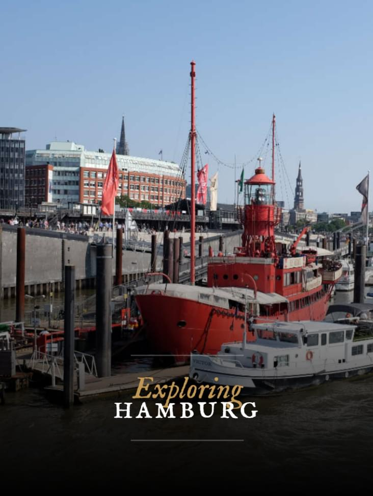
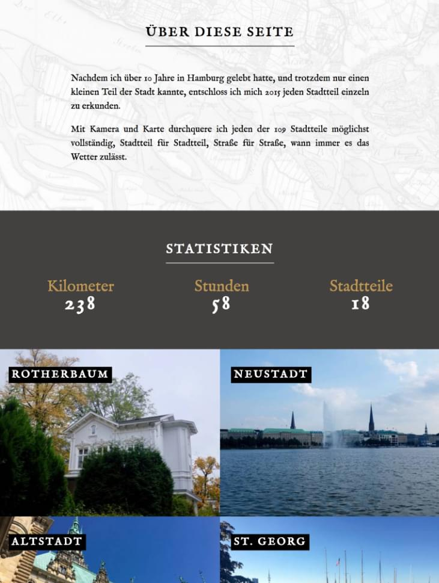
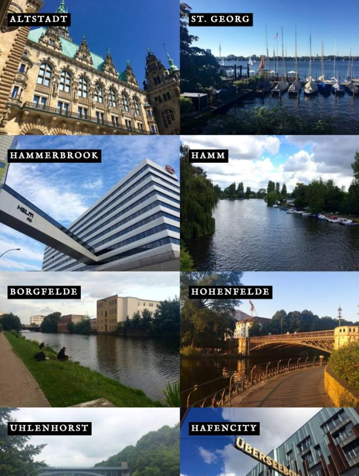
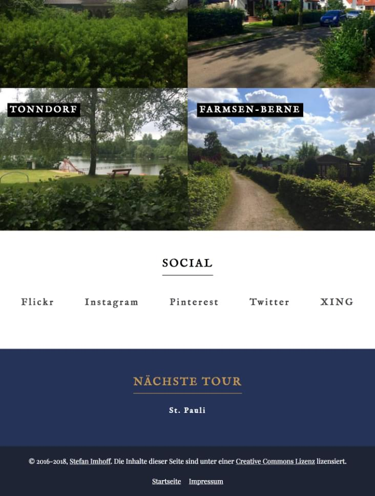
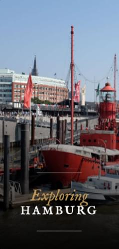
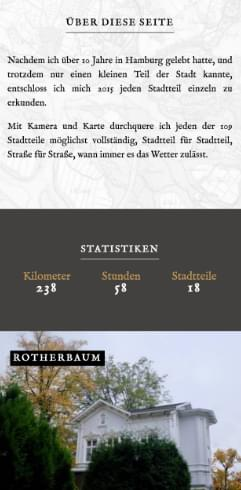
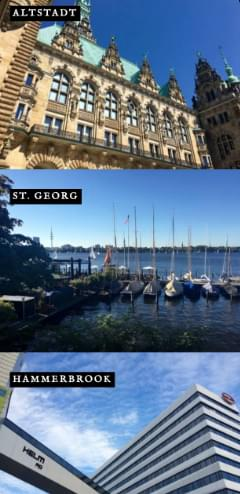

I created a [website](https://hamburg.stefanimhoff.de/) for one of my hobbies: I explore Hamburg, mostly walking, sometimes biking to find out more about the individual districts and to shoot photos. There are 109 districts in Hamburg and I plan to walk them all, street by street.

The website is mostly a **photography** blog, but I also write **short essays** about the districts. The website is written in English, so visitors from around the world can find out places to visit while staying in Hamburg.

---

## Color Palette

  
  
  
  
  
  

---

<figure class="light image-shadow">

</figure>

---

## Homepage

## Tablet & Phone

