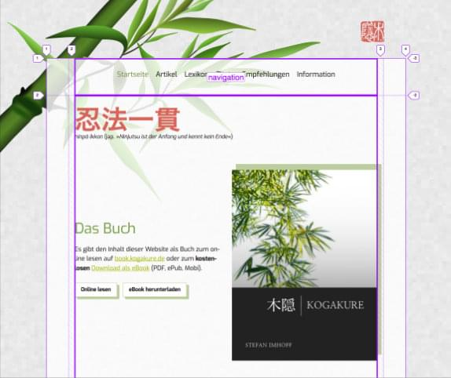
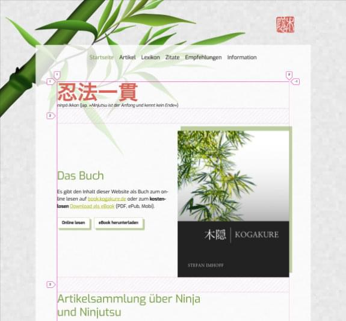
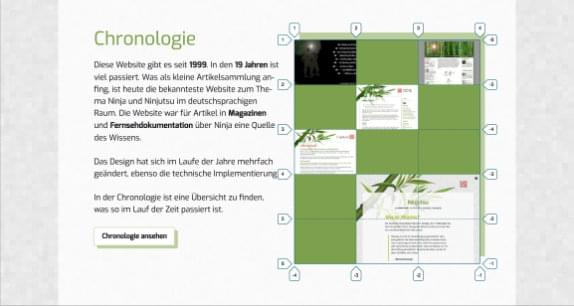
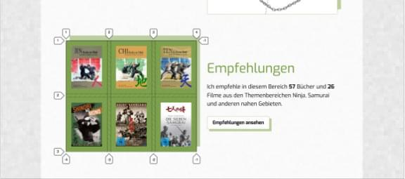
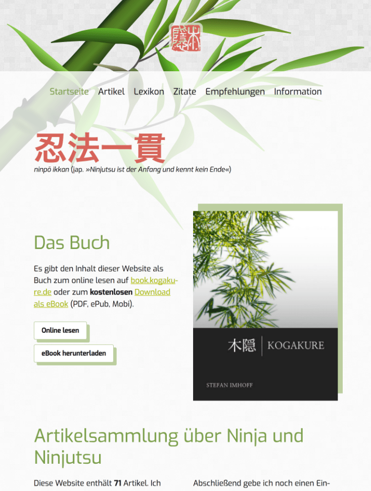

I redesigned my [Martial Arts Online Magazine](https://www.kogakure.de/) in 2017. Additionally, I moved the website from _Jekyll_ (as static page generator) to [Hugo](http://gohugo.io/). I used the **CSS Grid Layout** throughout the website, the homepage has **12 different grids**.

I removed clutter by removing some background patterns, added new hover animations for images and containers, added new buttons, and a new pulsing heart animation for the donation section.

I added **Service Worker** and full offline support for the website. The source programming is available on [GitHub](https://github.com/kogakure/website-hugo-kogakure.de).

## Color Palette










---

<figure class="light image-shadow">

</figure>

---

<figure class="light image-shadow">

</figure>

---

## Homepage

## Subpages

## Grid Layout

## Tablet & Phone

